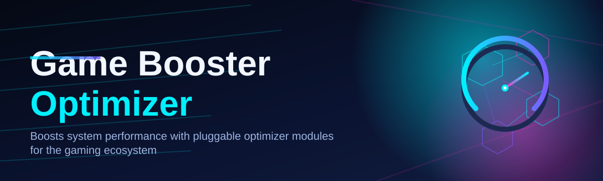

# game-booster-optimizer 🚀🎮

  

*One click. Every background process politely shown the door. Your frame counter says thank you.*

  

## 🧭 Overview

Windows was designed to be a general-purpose operating system, not a gaming console — and it shows the moment you alt-tab out of a raid boss and see forty telemetry services quietly chewing through your CPU cache. **game-booster-optimizer** started as a personal itch: I wanted my rig to behave like a dedicated gaming machine for the twenty minutes I actually played, without permanently disabling half of Windows or trusting some sketchy registry `.reg` file I found on a forum from 2014.

So this project exists as a transparent, inspectable game booster and system optimizer that treats your PC like a stage that needs clearing before the show starts. It suspends the noise — indexing services, background sync clients, telemetry pingers, visual effects nobody asked for — and hands the freed-up CPU scheduling priority, RAM headroom, and disk I/O straight back to your game. When you're done, it puts everything back exactly where it was. No permanent tweaks, no mystery.

This tool is for the player who wants consistent frame timing more than a flashy RGB dashboard: competitive shooter grinders chasing lower input latency, simulation and strategy fans running huge save files that hate background disk contention, and anyone on a laptop who's tired of watching a game booster app itself become the bottleneck. If you've ever wondered "why does closing Chrome tabs manually feel like a chore before every gaming session," that manual ritual is exactly what this automates.

---

## ⚡ What It Actually Does For You

> [!NOTE]
> Every capability below is reversible. The optimizer keeps a session snapshot so "boosted" state and "normal" state are just two sides of the same toggle.

- **One-tap Game Mode profiling** — detects the foreground game process and builds a session profile around it instead of applying a generic, one-size-fits-none tweak list.

- **Background process triage** — ranks running processes by real resource cost (not just name-matching a blocklist), then suspends the worst offenders instead of blindly killing things you might need.

- **RAM standby list flush** — clears cached memory pages that Windows hoards "just in case," giving large open-world titles cleaner allocation on level load.

- **CPU priority realignment** — nudges scheduler priority and core affinity toward the active game process without touching kernel-level thread scheduling in a way that could destabilize the system.

- **Network stack quieting** — pauses known background-sync and update traffic sources so your ping doesn't spike mid-match because a cloud drive decided now was a good time to upload.

- **Visual latency trims** — temporarily drops non-essential compositor and animation overhead on lower-end GPUs, restoring it automatically on exit.

- **One-file portability** — the whole tool runs as a standalone executable. No installer wizard, no background daemon phoning home.

- **Session revert on exit** — closing the game (or the app) triggers an automatic rollback, so nothing "sticks" beyond your play session unless you explicitly pin it.

---

## 🏁 How To Get Started

1. Visit the landing page via the download button above or below.

2. Grab the latest standalone `.exe` — no installer, no bundled extras.

3. Run it once; the optimizer scans your current system baseline before touching anything.

4. Launch your game as usual, hit **Boost**, and play. Exit the game (or click **Restore**) when you're done.

> [!TIP]
> First run takes a few extra seconds while it builds a baseline snapshot of your process list. Every run after that is near-instant.

---

## 🖥️ System Requirements

| Requirement | Detail |
|---|---|
| OS | Windows 10 (64-bit) or Windows 11 |
| Dependencies | None — fully standalone |
| Disk space | Under 50 MB |
| Admin rights | Recommended, for full process priority control |
| Internet | Not required after download |

  

---

## 🧱 How It Works

The architecture is intentionally boring in the best way — no hidden services, no scheduled tasks installing themselves behind your back. Everything happens in the foreground of a single running session:

1. **Baseline capture** — snapshot current process states, power plan, and visual settings.

2. **Game detection** — identify the active foreground game, either automatically or via manual pin.

3. **Resource reallocation** — suspend low-value background processes, flush standby memory, adjust priority.

4. **Play session** — the boosted state persists exactly as long as the game (or your override) is active.

5. **Automatic restore** — the snapshot from step 1 is replayed in reverse, returning the system to normal.

> [!IMPORTANT]
> The optimizer never modifies files inside your game's install directory. Every change it makes is at the OS/process level, which is what keeps it compatible with anti-cheat systems that dislike file-level tampering.

---

## 🧩 Troubleshooting

<strong>My game booster session didn't restore everything after I closed the game.</strong>

Check the log panel — some processes (particularly antivirus-managed services) refuse suspension requests and are skipped rather than forced, which is intentional and safe.

<strong>Frame rate feels the same before and after boosting.</strong>

If your bottleneck is GPU-bound rather than CPU/background-process-bound, the optimizer's gains will be smaller. It's a resource-contention fixer, not a magic overclock.

<strong>Windows Defender flagged the executable.</strong>

Standalone tools that adjust process priority and memory frequently trigger heuristic (not signature) flags. Check the landing page for the current hash to verify integrity.

<strong>Can I run this alongside other optimization software?</strong>

Yes, but overlapping process-priority tools can fight each other over the same handles. If you see odd behavior, disable one before boosting with the other.

<strong>Does this work for games running through a launcher (Steam, Epic, etc.)?</strong>

Yes — detection targets the actual game process, not the launcher wrapper, so it boosts correctly regardless of launcher.

---

## 🎛️ UI, UX & Personalization

- **Themes:** Dark (default), Light, and a high-contrast mode for streaming overlays.

- **Keyboard shortcuts:**

  | Shortcut | Action |
  |---|---|
  | `Ctrl+B` | Trigger Boost |
  | `Ctrl+R` | Force Restore |
  | `Ctrl+,` | Open Settings |
  | `Esc` | Minimize to tray |

- **Settings panel:** pin specific games, whitelist processes that should never be suspended, and toggle auto-boost-on-launch.

- **Tray-first design:** the app is meant to live quietly in your system tray between sessions, not eat a taskbar slot.

> [!WARNING]
> Whitelisting core Windows services out of caution is fine — but removing your antivirus or firewall from the protected list is not recommended and not something the tool encourages.

---

## 🤝 Contributing & Community

This project grew from a solo passion build into something a genuinely active community now shapes. Bug reports, profile suggestions for specific games, and pull requests are all welcome — open an issue first for larger changes so we can talk architecture before code.

> [!TIP]
> Looking for a good first contribution? Check issues tagged `good-first-issue` — many are game-specific profile tweaks that don't require touching core logic.

---

## 📜 License

Released under the [MIT License](LICENSE), 2026. Use it, fork it, build on it — just keep the license notice intact.

---

## ⚠️ Disclaimer

game-booster-optimizer adjusts operating-system-level process priorities and memory management; it does not modify game files, inject into game processes, or interact with anti-cheat systems. Results vary by hardware and by what's actually bottlenecking your specific setup — this tool clears contention, it doesn't manufacture GPU horsepower out of thin air. Use at your own discretion.

